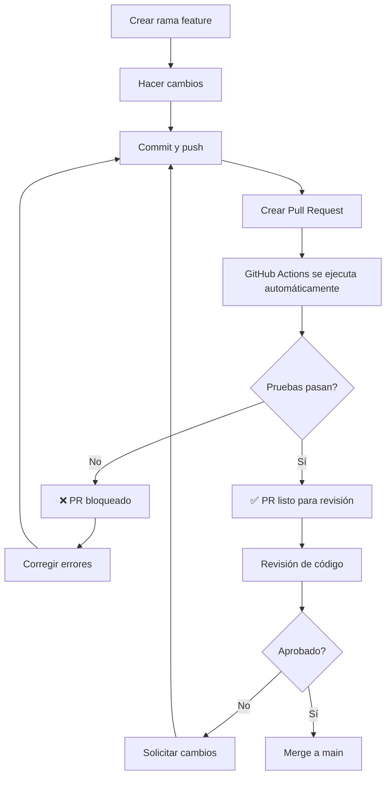

# 🔒 Configuración de GitHub - Protección de Rama y CI/CD

## 📋 Tabla de Contenidos

1. [Protección de Rama Main](#protección-de-rama-main)
2. [Configuración de GitHub Actions](#configuración-de-github-actions)
3. [Flujo de Trabajo con Pull Requests](#flujo-de-trabajo-con-pull-requests)
4. [Resolución de Problemas](#resolución-de-problemas)

---

## 🔐 Protección de Rama Main

Para configurar la protección de la rama `main` y requerir que los cambios entren solo por Pull Request:

### Pasos para Configurar

1. **Ir a la configuración del repositorio**
   - Abre tu repositorio en GitHub: https://github.com/camiloramosm/taller1_api
   - Click en **Settings** (⚙️ Configuración)

2. **Acceder a Branch Protection Rules**
   - En el menú lateral izquierdo, click en **Branches**
   - En la sección "Branch protection rules", click en **Add rule** o **Add branch protection rule**

3. **Configurar la regla para `main`**
   
   **Branch name pattern:** `main`

   **Protecciones requeridas:**
   
   ✅ **Require a pull request before merging**
   - ✅ Require approvals: `1` (mínimo 1 aprobación)
   - ✅ Dismiss stale pull request approvals when new commits are pushed
   - ✅ Require review from Code Owners (opcional)

   ✅ **Require status checks to pass before merging**
   - ✅ Require branches to be up to date before merging
   - **Status checks encontrados:**
     - `Build and Run Tests`
     - `Validate Pull Request`
     - `Code Quality Checks`
   
   ✅ **Require conversation resolution before merging**
   - Todos los comentarios deben resolverse antes de hacer merge

   ✅ **Require linear history** (opcional)
   - Mantiene un historial de commits limpio

   ✅ **Do not allow bypassing the above settings**
   - Ni siquiera los administradores pueden saltarse estas reglas

   ❌ **Allow force pushes** (Dejar desactivado)
   
   ❌ **Allow deletions** (Dejar desactivado)

4. **Guardar cambios**
   - Click en **Create** o **Save changes**

### Configuración Visual

```
┌─────────────────────────────────────────────────┐
│ Branch protection rule                          │
├─────────────────────────────────────────────────┤
│ Branch name pattern: main                       │
│                                                 │
│ ☑ Require a pull request before merging        │
│   ├─ Required approvals: 1                     │
│   ├─ ☑ Dismiss stale approvals                │
│   └─ ☐ Require review from Code Owners        │
│                                                 │
│ ☑ Require status checks to pass                │
│   ├─ ☑ Require branches to be up to date      │
│   └─ Status checks:                            │
│       • Build and Run Tests                    │
│       • Validate Pull Request                  │
│       • Code Quality Checks                    │
│                                                 │
│ ☑ Require conversation resolution              │
│ ☐ Require linear history                       │
│ ☑ Do not allow bypassing settings              │
│ ☐ Allow force pushes                           │
│ ☐ Allow deletions                              │
│                                                 │
│              [Save changes]                     │
└─────────────────────────────────────────────────┘
```

---

## ⚙️ Configuración de GitHub Actions

### Workflows Incluidos

#### 1. **CI - Build and Test** (`.github/workflows/ci.yml`)

Se ejecuta en:
- ✅ Push a `main` o `develop`
- ✅ Pull requests a `main` o `develop`

**Pasos:**
1. Checkout del código
2. Setup de .NET 9
3. Restauración de dependencias
4. Build de la solución
5. Ejecución de pruebas unitarias
6. Publicación de resultados

#### 2. **PR Validation** (`.github/workflows/pr-validation.yml`)

Se ejecuta en:
- ✅ Pull requests a `main`

**Pasos:**
1. Validación completa del PR
2. Pruebas con cobertura de código
3. Verificaciones de calidad de código
4. Comentarios automáticos en el PR

#### 3. **Code Quality Checks** (incluido en pr-validation)

Verifica:
- ✅ Formato del código
- ✅ Análisis estático
- ✅ Convenciones de nomenclatura

### Permisos Necesarios

Para que GitHub Actions funcione correctamente, asegúrate de que:

1. **Actions** estén habilitadas:
   - Settings → Actions → General
   - ✅ Allow all actions and reusable workflows

2. **Workflow permissions**:
   - Settings → Actions → General → Workflow permissions
   - ✅ Read and write permissions
   - ✅ Allow GitHub Actions to create and approve pull requests

---

## 🔄 Flujo de Trabajo con Pull Requests

### Proceso Completo



### Comandos Git para Desarrolladores

#### 1. Crear una nueva rama para tu feature

```bash
# Asegúrate de estar en main y actualizado
git checkout main
git pull origin main

# Crea una nueva rama
git checkout -b feature/nombre-de-tu-feature
```

#### 2. Hacer cambios y commit

```bash
# Hacer tus cambios...

# Ver el estado
git status

# Agregar archivos
git add .

# Commit con mensaje descriptivo
git commit -m "feat: descripción del cambio"
```

#### 3. Ejecutar pruebas localmente ANTES de push

```bash
# Restaurar dependencias
dotnet restore

# Compilar
dotnet build

# Ejecutar pruebas
dotnet test --verbosity normal

# Verificar que todo pase ✅
```

#### 4. Push a GitHub

```bash
git push origin feature/nombre-de-tu-feature
```

#### 5. Crear Pull Request

1. Ve a GitHub: https://github.com/camiloramosm/taller1_api
2. Verás un banner amarillo: "Compare & pull request"
3. Click en **Compare & pull request**
4. Completa la plantilla de PR
5. Click en **Create pull request**

#### 6. Esperar validación automática

- ⏳ GitHub Actions se ejecutará automáticamente
- ✅ Si pasa: PR listo para revisión
- ❌ Si falla: Revisa los logs y corrige

#### 7. Merge (después de aprobación)

```bash
# Una vez aprobado y merged, actualiza tu main local
git checkout main
git pull origin main

# Elimina la rama feature (opcional)
git branch -d feature/nombre-de-tu-feature
```

---

## 🚨 Resolución de Problemas

### ❌ "All checks must pass before merging"

**Problema:** Las pruebas fallan en GitHub Actions

**Solución:**
1. Ve a la pestaña **Actions** en GitHub
2. Click en el workflow fallido
3. Revisa los logs para ver qué falló
4. Corrige el problema localmente
5. Haz commit y push de nuevo

```bash
# Corregir el problema
git add .
git commit -m "fix: corregir pruebas fallidas"
git push
```

### ❌ "This branch is out-of-date with the base branch"

**Problema:** Tu rama está desactualizada respecto a `main`

**Solución:**
```bash
# Actualizar tu rama
git checkout main
git pull origin main
git checkout feature/tu-rama
git merge main

# Resolver conflictos si existen
# Luego hacer push
git push
```

### ❌ "At least 1 approving review is required"

**Problema:** No tienes suficientes aprobaciones

**Solución:**
1. Pide a un compañero/revisor que revise tu PR
2. Si eres el único desarrollador, puedes:
   - Desactivar temporalmente la regla de aprobaciones
   - O crear una cuenta de GitHub secundaria para testing

### ❌ "Review required from code owners"

**Problema:** Si tienes configurado CODEOWNERS

**Solución:**
1. Espera aprobación de un code owner
2. O modifica `.github/CODEOWNERS` si es necesario

---

## 📊 Verificación de Estado

### Checklist de Configuración Completa

- [ ] ✅ Protección de rama `main` configurada
- [ ] ✅ GitHub Actions habilitado
- [ ] ✅ Workflow CI funcionando
- [ ] ✅ Workflow PR Validation funcionando
- [ ] ✅ Permisos de workflow configurados
- [ ] ✅ Plantilla de PR creada
- [ ] ✅ Equipo informado del nuevo proceso

### Comandos de Verificación

```bash
# Verificar que la rama main está protegida
# (debe dar error al intentar push directo)
git checkout main
echo "test" >> test.txt
git add test.txt
git commit -m "test"
git push origin main
# ❌ Debe fallar con: "remote: error: GH006: Protected branch update failed"

# Si falla correctamente, revertir:
git reset --hard HEAD~1
```

---

## 🎓 Mejores Prácticas

1. **Siempre crea una rama para tus cambios**
   ```bash
   git checkout -b feature/mi-feature
   ```

2. **Ejecuta las pruebas localmente antes de push**
   ```bash
   dotnet test
   ```

3. **Escribe mensajes de commit descriptivos**
   ```bash
   git commit -m "feat: agregar validación de email"
   git commit -m "fix: corregir error en cálculo de fecha"
   git commit -m "docs: actualizar README con ejemplos"
   ```

4. **Mantén tus PRs pequeños y enfocados**
   - Un PR = Una funcionalidad/corrección
   - Más fácil de revisar
   - Menos conflictos

5. **Responde a comentarios de revisión**
   - Mantén la conversación activa
   - Resuelve todos los comentarios

---

## 🔗 Enlaces Útiles

- [Repositorio](https://github.com/camiloramosm/taller1_api)
- [GitHub Actions Docs](https://docs.github.com/en/actions)
- [Branch Protection Docs](https://docs.github.com/en/repositories/configuring-branches-and-merges-in-your-repository/managing-protected-branches/about-protected-branches)
- [Pull Request Best Practices](https://docs.github.com/en/pull-requests/collaborating-with-pull-requests)

---

## 📞 Soporte

Si tienes problemas con la configuración, verifica:

1. Logs de GitHub Actions
2. Permisos del repositorio
3. Configuración de protección de rama

**¿Necesitas ayuda?** Crea un issue en el repositorio.

---

**Última actualización:** Noviembre 2025

